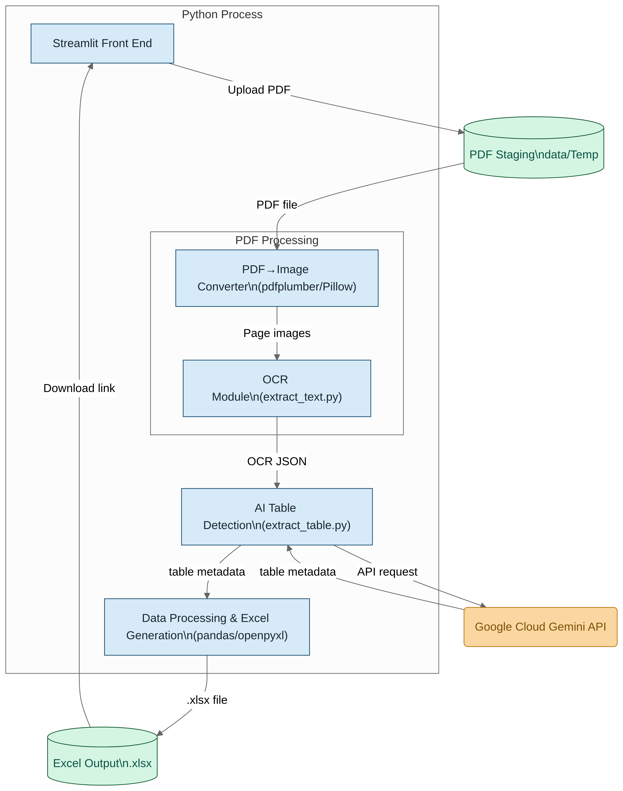
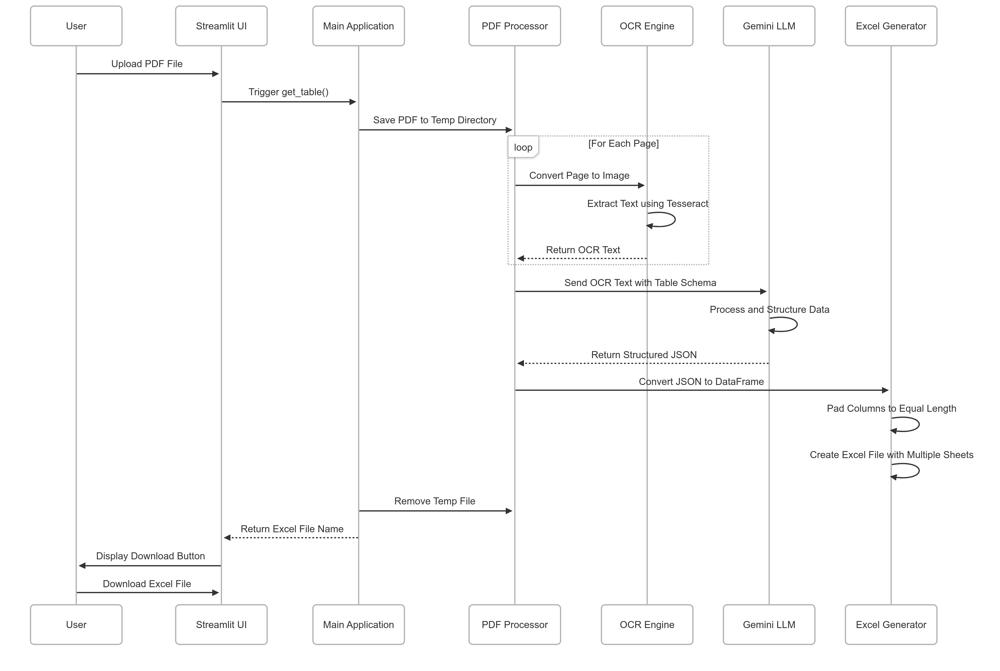

# Table Extractor

A powerful PDF table extraction tool that uses OCR and AI to extract structured table data from PDF documents and convert it into Excel format.

## Features

- PDF to Excel conversion with table structure preservation
- OCR-based text extraction using Tesseract
- AI-powered table structure recognition using Google's Gemini model
- Multi-page PDF support
- Streamlit-based user interface
- Automatic table column detection and alignment
- Excel output with multiple sheets (one per page)

## Prerequisites

- Python 3.x
- Tesseract OCR
- Google Cloud API credentials (for Gemini model)

## Installation

1. Clone the repository:
```bash
git clone <repository-url>
cd table-extractor
```

2. Install the required Python packages:
```bash
pip install -r requirements.txt
```

3. Install Tesseract OCR:
```bash
# For Ubuntu/Debian
sudo apt-get install tesseract-ocr

# For macOS
brew install tesseract

# For Windows
# Download and install from https://github.com/UB-Mannheim/tesseract/wiki
```

4. Set up Google Cloud credentials:
- Create a Google Cloud project
- Enable the Gemini API
- Set up your API credentials

## Project Structure

```
table-extractor/
├── app/
│   ├── main.py           # Streamlit application and main logic
│   ├── extract_table.py  # Table extraction and processing
│   └── extract_text.py   # OCR text extraction from PDFs
├── data/
│   └── Temp/            # Temporary storage for uploaded files
└── README.md
```

## Usage

1. Start the Streamlit application:
```bash
streamlit run app/main.py
```

2. Open your web browser and navigate to the provided local URL (typically http://localhost:8501)

3. Upload a PDF file using the file uploader

4. Click "Submit" to process the PDF

5. Once processing is complete, download the extracted Excel file

## Supported Table Formats

The application is designed to extract tables with the following columns:
- Symbol
- Parts Name
- Material
- Q'ty
- Parts No

## How It Works

1. **PDF Processing**: The uploaded PDF is processed page by page
2. **OCR Extraction**: Each page is converted to an image and processed using Tesseract OCR
3. **Table Detection**: The AI model identifies and structures the table data
4. **Excel Generation**: The extracted data is formatted and saved as an Excel file with multiple sheets

### Application Diagram



### Sequence Diagram



## Dependencies

- streamlit
- pytesseract
- pdfplumber
- pandas
- langchain
- langchain-google-genai
- Pillow
- openpyxl

## License

[MIT License](https://github.com/yash-meshram/table-extractor?tab=MIT-1-ov-file)

